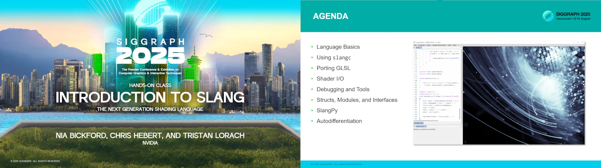

# Slang at SIGGRAPH 2025

Welcome to the Slang landing page for SIGGRAPH 2025. Here you'll find information about our events and accompanying materials for our interactive lab, neural shading course, and Birds of a Feather session, and you can download our latest [release, 2025.14.3](https://github.com/shader-slang/slang/releases/tag/v2025.14.3).

Links to the materials for each session will be posted as they become available.

## [Hands-On Class: Introduction to Slang](https://s2025.conference-schedule.org/?post_type=page&p=14&id=gensubcur_104&sess=sess287)

**Sunday, August 10, 4:00-5:30 PM PDT**  
**West Building, Rooms 121-122**

Join us for an introductory lab for the Slang shading language, covering topics from language basics to advanced features like generics and automatic differentiation.

This lab also includes a few small projects and coding puzzles so you can try out what is presented, using a new shader editor built for this lab! We also demo how Slang works with debuggers like RenderDoc, and port a GLSL shader live.

Download the full lab materials and slides below

[Lab materials with slides »](https://developer.download.nvidia.com/ProGraphics/nvpro-samples/SlangLab/Lab.zip)  
[Slides only »](https://developer.download.nvidia.com/ProGraphics/nvpro-samples/SlangLab/Slides.pdf)

## [Birds of a Feather: Developing with Slang](https://s2025.conference-schedule.org/?post_type=page&p=14&id=bof_177&sess=sess558)

**Wednesday, August 13, 2:30-3:30 PM PDT**  
**British Ballroom, Fairmont Waterfront**

The Slang shading language and compiler is a proven open-source technology empowering real-time graphics developers with flexible, innovative features that complement existing shading languages, including neural computation inside graphics shaders. Join us for the latest updates from the Slang Working Group and discussions around key shader community topics, including new capabilities and future directions, case studies, tools and techniques.

## [An Introduction to Neural Shading](https://s2025.conference-schedule.org/?post_type=page&p=14&id=gensub_420&sess=sess208)

**Thursday, August 14, 9:00 AM-12:15 PM PDT**  
**West Building, Rooms 109-110**

This course teaches the fundamentals of neural shading, wherein traditional graphics algorithms are replaced with simple neural networks. Both theory and practical implementation will be covered, along with hardware acceleration, and production deployment. Follow along with the instructors using interactive samples written in Python & Slang!

_For more information about SIGGRAPH 2025, visit the [official conference website](https://s2025.siggraph.org/)._
