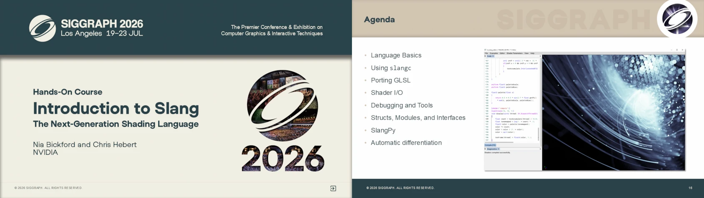

Slang is at SIGGRAPH 2026 in Los Angeles! Join us for three courses, a Slang Birds of a Feather session, and several community events that explore modern shading, graphics, compute, and AI. Whether you are new to shader programming, building neural graphics workflows, or interested in the future of the shading ecosystem, there is a session for you.

Additional session materials will be added here as they become available. Join the [Slang community on Discord](https://khr.io/slangdiscord) to keep the conversation going.

## Courses

### [Introduction to Neural Shading](https://s2026.conference-schedule.org/presentation/?id=gensub_279&sess=sess195)

**Sunday, July 19, 9:00 AM-12:15 PM PDT**  
**Room 515 A**

Discover the foundations of neural shading: using compact neural networks alongside graphics techniques to create efficient, expressive rendering workflows. This course introduces the ideas and practical tools behind neural shading for graphics developers.

[View the course materials on GitHub](https://github.com/shader-slang/neural-shading-s26/).

[Download the course slides (PDF)](https://github.com/shader-slang/neural-shading-s26/raw/refs/heads/main/slides/Neural_Shading_Course_Slides_2026.pdf).

### [Introduction to Slang: The Next-Generation Shading Language](https://s2026.conference-schedule.org/presentation/?id=gensub_172&sess=sess258)

**Tuesday, July 21, 10:15-11:45 AM PDT**  
**Concourse Hall**

Get started with Slang, the open-source shading language designed for modern graphics. Learn how Slang brings powerful abstractions, portability, and developer-friendly tooling to real-time rendering and GPU programming.

Download the full lab materials and slides below:

[Lab materials with slides »](https://developer.download.nvidia.com/ProGraphics/nvpro-samples/SlangLab/Lab-2026.zip)\
[Slides only »](https://developer.download.nvidia.com/ProGraphics/nvpro-samples/SlangLab/Slides-2026.pdf)

### [Hands-On Machine Learning with Slang: Building High-Performance GPU Inference Pipelines](https://s2026.conference-schedule.org/presentation/?id=gensub_263&sess=sess261)

**Tuesday, July 21, 12:00-1:30 PM PDT**  
**Concourse Hall**

Explore how Slang can help build efficient GPU inference pipelines. This hands-on session focuses on practical machine-learning workflows and the tools needed to bring high-performance GPU code into production.

## High-Performance Graphics 2026

### [neural.slang: A Standard Module for Inline Neural Networks in Shaders](https://www.highperformancegraphics.org/2026/schedule/)

**Friday, July 17, 11:00 AM-12:00 PM PDT** 
**Hot3D Session 1**

Learn about neural.slang, a standard module for integrating inline neural networks in shaders. This session is part of [High-Performance Graphics 2026](https://www.highperformancegraphics.org/2026/).

[Download the HPG talk slides (PDF)](/assets/downloads/neural_slang_hot3d.pdf).

## Slang and community events

### [Khronos Fast Forward](https://s2026.conference-schedule.org/presentation/?id=bof_115&sess=sess295)

**Monday, July 20, 1:00-2:00 PM PDT**  
**Room 518**

Catch a brief preview of the Slang Birds of a Feather session as part of Khronos Fast Forward.

### [Real-Time Shading BOF: Building a Community Around Shaders, Shading Languages, and Tech Artist Workflows](https://s2026.conference-schedule.org/presentation/?id=bof_111&sess=sess291)

**Tuesday, July 21, 1:00-2:30 PM PDT**  
**Room 518**

Join this Khronos community forum on the people, languages, and workflows shaping real-time shading.

### [Slang in Action: Modern Shading for Graphics, Compute, and AI](https://s2026.conference-schedule.org/presentation/?id=bof_122&sess=sess300)

**Wednesday, July 22, 1:30-2:00 PM PDT**  
**JW Marriott, Plaza 1**  

Join the Slang Birds of a Feather session for updates from the Slang community and a conversation about how the language is evolving for graphics, compute, and AI.

### [NVIDIA RTX Rendering Day | Practical Advances in AI-Accelerated Ray Tracing](https://s2026.conference-schedule.org/presentation/?id=ind_125&sess=sess538)

**Wednesday, July 22, 1:00-1:50 PM PDT**  
**Los Angeles Convention Center, Room 502A**

This NVIDIA RTX Rendering Day session will explore advances in ray tracing technology, including new features and support in Slang and neural rendering.

_For more information about SIGGRAPH 2026, visit the [official conference website](https://s2026.siggraph.org/)._
